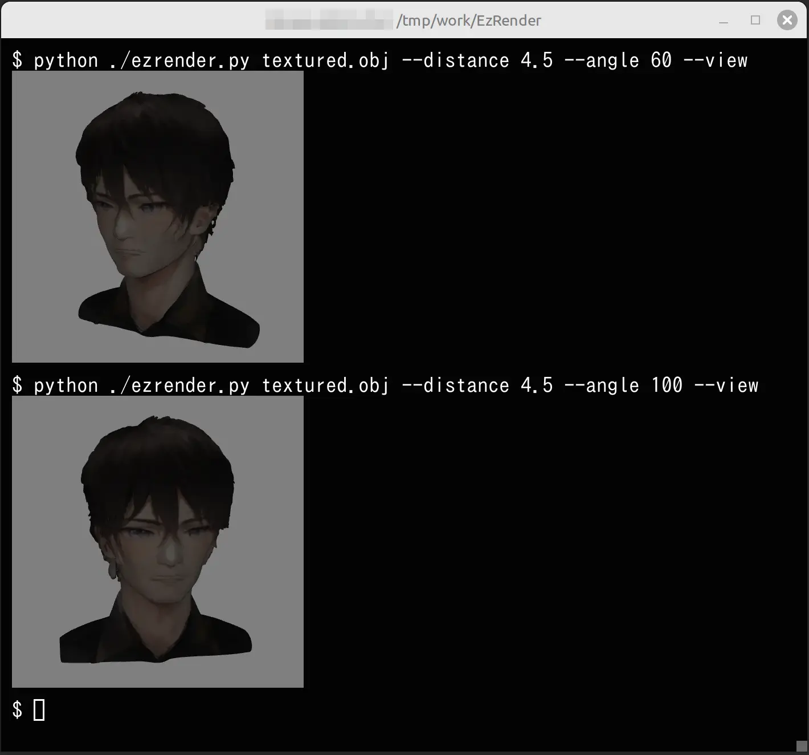

# EzRender

`EzRender` は、`.glb` や `.obj` 形式の 3D モデルをコマンドラインからレンダリングし、静止画像として保存・表示できる Python スクリプトです。

`timg` を使用してターミナル内で画像を表示できるため、簡易的な確認に便利です。


---

## 特長

- `.obj` / `.glb` に対応
- カメラ位置の指定が可能：
  - 極座標（距離と角度）
  - 直交座標（x, y, z）
- WebP 形式での画像保存
- `timg` を使用したターミナル内での即時プレビュー表示（mlterm や ezterm などの Sixel 対応端末が必要）
- 出力画像サイズの指定（デフォルト：512x512）
- ヘッドレス環境での GPU レンダリングが可能（EGL 使用）
- モデル情報の表示機能（`--info` オプション）

---

## インストール

```bash
sudo apt-get install timg
pip install trimesh pyrender PyOpenGL Pillow tabulate
```

---

## 使い方

```bash
python ezrender.py MODEL_FILE [オプション]
```

### 使用例

#### 1. マルチビュー画像の表示

```bash
python ezrender.py model.glb
```

#### 2. モデル中心から距離 3.0、方位角 45 度で画像を表示（保存しない）

```bash
python ezrender.py model.glb --distance 3.0 --angle 45
```

#### 3. カメラ位置を x=1, y=2, z=3 で指定し、画像を保存（表示なし）

```bash
python ezrender.py model.obj --cam-xyz 1.0,2.0,3.0 --output output.webp --no-view
```

#### 4. 出力画像サイズを 1024x768 に指定して保存

```bash
python ezrender.py model.obj --cam-xyz 0.5,1.5,2.0 --output view.webp --size 1024x768
```

#### 5. モデル情報を表示（メッシュ数、頂点数、色情報など）

```bash
python ezrender.py model.glb --info
```

---

## オプション一覧

| オプション             | 説明                                                                 |
|------------------------|----------------------------------------------------------------------|
| `--distance`           | カメラの極座標モード：中心からの距離（`--angle` とセット）          |
| `--angle`              | カメラの極座標モード：水平回転角（度）                              |
| `--cam-xyz`            | カメラ位置を `x,y,z` 形式で直接指定                                 |
| `--output`             | 画像保存ファイル名（拡張子 `.webp`）                                |
| `--no-view`            | `timg` での画像表示を無効化（デフォルトでは表示されます）            |
| `--size WxH`           | 出力画像サイズ（例：`--size 1024x768`、デフォルト：512x512）         |
| `--light-intensity`    | 光源の明るさ（指定がない場合はモデルスケールに応じて自動設定）       |
| `--info`               | モデル情報を表示（メッシュ数、頂点数、色情報、UV マッピングの有無）  |

---

## モデル情報の表示例（`--info` オプション）

以下は、`--info` オプションを使用した際の出力例です。

```
🔍 Model Information (Total Meshes: 2)

+--------+-----------+--------+------------------------------+-------------+
| Mesh   | Vertices  | Faces  | Color Attribution            | UV Mapping  |
+--------+-----------+--------+------------------------------+-------------+
| 0      | 1024      | 2048   | Texture Mapping (UV + Image) | Yes         |
| 1      | 300       | 600    | Vertex Color (RGBA)          | No          |
+--------+-----------+--------+------------------------------+-------------+
```

---

## ライセンス

MIT
