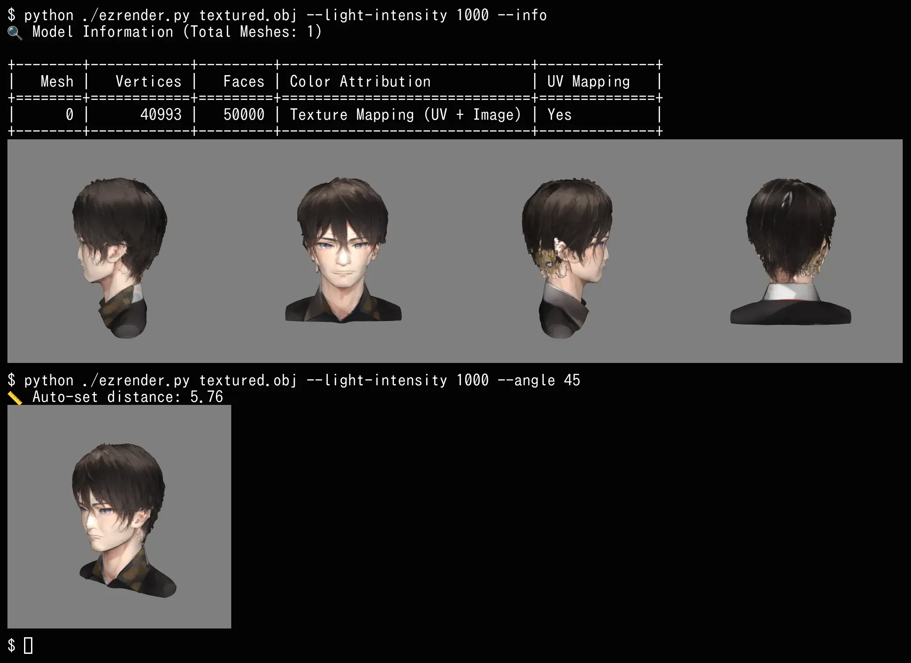

# EzRender

**ezrender** は `.glb` や `.obj` 形式の 3Dモデルを、コマンドでレンダリングして静止画像として保存・表示できる Python スクリプトです。表示は timg を使ってターミナル内に表示しますので、ちょっとした確認に便利です。

## 特長

- `.obj` / `.glb` に対応
- カメラの位置を極座標（距離と角度）または x,y,z で指定可能
- WebP形式での画像保存
- `timg` コマンドを使って即時プレビュー表示（mlterm や wezterm などのSixel対応端末が必要）
- 出力サイズの指定（デフォルト512x512）
- ヘッドレス（X不要）でのGPUレンダリングが可能（EGL使用）



## インストール

```bash
sudo apt-get install timg
pip install trimesh pyrender PyOpenGL Pillow
```

## 使い方

```bash
python ezrender.py MODEL_FILE [オプション]
```

### 使用例

#### 1. モデル中心から距離3.0、方位角45度で画像を表示（保存しない）

```bash
python ezrender.py model.glb --distance 3.0 --angle 45 --view
```

#### 2. カメラ位置をx=1, y=2, z=3で指定し、画像を保存（表示なし）

```bash
python ezrender.py model.obj --cam-xyz 1.0,2.0,3.0 --output output.webp
```

#### 3. 上記のカメラ位置で画像を保存し、さらに表示もする

```bash
python ezrender.py model.obj --cam-xyz 1.0,2.0,3.0 --output output.webp --view
```

#### 4. 出力画像サイズを1024x768に指定して保存

```bash
python ezrender.py model.obj --cam-xyz 0.5,1.5,2.0 --output view.webp --size 1024x768
```

## オプション一覧

| オプション        | 説明 |
|------------------|------|
| `--distance`      | カメラの極座標モード：中心からの距離（`--angle`とセット） |
| `--angle`         | カメラの極座標モード：水平回転角（度） |
| `--cam-xyz`       | カメラ位置を `x,y,z` 形式で直接指定 |
| `--output`        | 画像保存ファイル名（拡張子 .webp） |
| `--view`          | `timg` で画像を表示（Linuxターミナルのみ） |
| `--size WxH`      | 出力画像サイズ（例: `--size 1024x768`、デフォルト512x512） |

## ライセンス

MIT License（[LICENSE](./LICENSE) を参照）

---

© 2025 Daisuke TAKAGO
